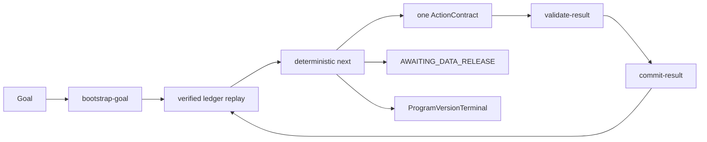

# RP-001 Autonomous Research Runtime

이 런타임은 사용자가 제공하는 `Goal + DataRelease`만으로 연구 상태를 복원하고 다음 유효 행동을 결정하도록 구성되어 있습니다. 완성된 Goal 파일을 수정하지 않으며, 연구 상태의 단일 진실 공급원은 원본 Goal에 결박된 ProgramSpec과 append-only ledger입니다.



## 시작 방법

1. 완성된 Goal 파일은 수정하거나 복사하지 않습니다.
2. 새 Codex thread에서 원본 Goal의 절대경로만 지정합니다.

```text
Use $autonomous-research to execute /absolute/path/to/goal.md until its bounded
ProgramVersionTerminal or AWAITING_DATA_RELEASE state.
```

3. 런타임은 Goal SHA-256에서 program ID와 output root를 결정하고 frozen preset으로 ProgramSpec을 자동 생성합니다.
4. 런타임이 DataRequest를 내면 사용자가 manifest를 DataRelease로 제공합니다. 수집기는 이 런타임의 작업 범위가 아닙니다.

`bootstrap-goal`은 Goal 전체 SHA-256을 계산해 동결 ProgramSpec에 주입합니다. 같은 Goal을 다시 지정하면 새 program을 만들지 않고 기존 ledger를 검증·재개하며, Goal이 한 바이트라도 달라지면 별도 program ID가 생성됩니다.

RP-001 preset의 `RQ-001`부터 `RQ-005`는 원본 Goal 3절의 궁극적 목표 A부터 E에 순서대로 대응합니다. 탐색예산, 허용 Action, DataRelease 경계와 bounded terminal 문구는 Goal 본문에서 추출하거나 사용자가 다시 쓰지 않고 런타임 preset에서 공급합니다.

## 운용 경계

- 모든 결과는 `research/rp-001/autonomy-runs/<programId>/` 아래에만 생성합니다.
- live collection root, raw/canonical store, 기존 RP-001/S2 artifact는 수정하지 않습니다.
- confirmation은 수식 동결 뒤 사용자 DataRelease로만 등록하고 동결 FormulaVersion SHA-256에 결박하며 등록 시 소진 처리합니다.
- confirmation 통과만으로 채택할 수 없으며 비용·위험 Gate까지 통과해야 `ConfirmationPassed`가 됩니다.
- 주문, 조건주문, 계좌, 포지션, 자산 endpoint는 허용하지 않습니다.
- 실패한 후보와 무효 실행도 ledger에 남으며 한 cycle 실패는 프로그램 종료가 아닙니다.
- 실패 종료는 최소 coverage와 동결 hard search budget이 모두 실제로 소진된 뒤에만 허용하며, 주관적인 `successorAvailable=false`만으로 종료하지 않습니다.
- 종료 주장은 등록된 유한 탐색범위에만 한정합니다.

## 비활성 preset

Hook 구성은 [presets/hooks.disabled.json](presets/hooks.disabled.json)에 `inactive` 상태로 보관됩니다. 현재 `.codex/hooks.json`은 만들지 않으므로 데이터 수집 또는 기존 thread에 자동 적용되지 않습니다. Scheduled task도 생성하지 않습니다. 두 기능은 합성 파일럿과 사용자 검토 후 별도 활성화해야 합니다.
